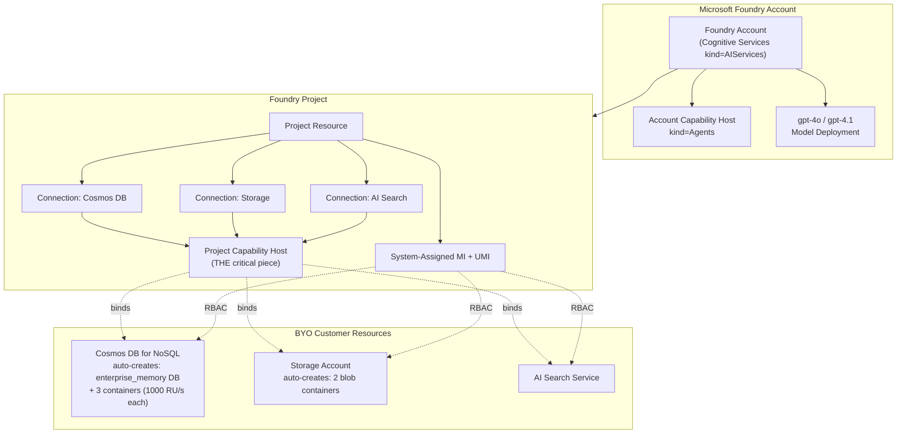

# Foundry Standard Agent Setup — Bicep Walkthrough (BYO Cosmos DB)

> 目標：在 **Microsoft Foundry Agent Service** 上啟用 **Standard Setup**，把 thread / file / vector 三類 agent state 全部放進客戶自己的 Azure 資源（Cosmos DB / Storage / AI Search），符合 FSI、政府、電信等受監管產業的 data sovereignty 要求。
>
> **官方參考**：[`learn.microsoft.com/azure/foundry/agents/concepts/standard-agent-setup`](https://learn.microsoft.com/en-us/azure/foundry/agents/concepts/standard-agent-setup)
> **官方 Bicep sample**：[`github.com/microsoft-foundry/foundry-samples/tree/main/infrastructure/infrastructure-setup-bicep/43-standard-agent-setup-with-customization`](https://github.com/microsoft-foundry/foundry-samples/tree/main/infrastructure/infrastructure-setup-bicep/43-standard-agent-setup-with-customization)

---

## 1. 為什麼一定要走 Bicep

| 問題                                      | 答案                                                                                                                                                                   |
| ----------------------------------------- | ---------------------------------------------------------------------------------------------------------------------------------------------------------------------- |
| Portal 能不能用 UI 設定 Standard Setup？  | **不行**。官方文件原文：「The Foundry portal currently supports only basic agent setup.」                                                                              |
| Cosmos DB connection 能不能在 portal 加？ | **不行**。Cosmos DB connection 仍是 **Preview**，且「Connection creation is supported only through code.」                                                             |
| 可以用 az CLI 手動建嗎？                  | 可以，分 6 個 Phase、約 30–45 分鐘，但容易漏 role assignment 或忘記 capability host 設定，**不建議用於 production**。                                                  |
| 那建議路徑？                              | 用官方 **Bicep template (43-standard-agent-setup-with-customization)**，可指定既有 Cosmos DB / Storage / AI Search / Azure OpenAI 的 resource ID，重複部署也保證一致。 |

> **重點限制**：Capability Host 一旦建立**無法 update**，要改設定只能砍 project 重來。所以 Bicep + GitOps 是唯一合理路徑。

---

## 2. Pre-flight Checklist

```bash
# 1. Azure CLI 版本 >= 2.50
az --version

# 2. 登入 + 切到目標 subscription
az login
az account set --subscription "<your-subscription-id>"

# 3. 確認自己有 Owner 或 User Access Administrator on RG
#    (建 role assignment 需要)
az role assignment list \
  --assignee "$(az ad signed-in-user show --query id -o tsv)" \
  --resource-group "<your-rg>" \
  -o table

# 4. ARM64 (Snapdragon X Elite) 注意事項
#    az CLI 對 ARM64 Linux 原生支援，沒問題。
#    Bicep CLI 透過 az bicep install 會抓對應 binary，也 OK。
az bicep install
az bicep version
```

### 需要先準備好的既有資源（或讓 template 新建）

| 資源                                | 建議                                                   | FSI 注意事項                                                   |
| ----------------------------------- | ------------------------------------------------------ | -------------------------------------------------------------- |
| **Azure Cosmos DB for NoSQL**       | ≥ **3000 RU/s** (每 project × 3 container × 1000 RU/s) | 開 **CMK** + **Private Endpoint** + 關閉 public network access |
| **Azure Storage (StorageV2)**       | hierarchical namespace **不要開** (Agent 用 flat blob) | CMK + PE，啟用 **soft delete**                                 |
| **Azure AI Search**                 | **Standard S1** 起跳（Basic 不支援 PE）                | PE + Managed Identity 認證                                     |
| **Azure Key Vault**                 | Premium (FIPS 140-2 L3 HSM)                            | RBAC mode，不用 access policy                                  |
| **Application Insights** (optional) | Workspace-based                                        | 連到 Log Analytics workspace                                   |

> **RU/s 算式**：`projects × 3 containers × 1000 RU/s`。兩個 project = 6000 RU/s。RU/s 不夠是最常見的 `CapabilityHostProvisioningFailed` 原因。

---

## 3. 架構與資源關係圖



### Cosmos DB 內會自動產生的東西

```
<your-cosmosdb-account>/
└── enterprise_memory                  (database, scope for RBAC)
    ├── thread-message-store           (1000 RU/s, 使用者對話)
    ├── system-thread-message-store    (1000 RU/s, 系統訊息)
    └── agent-entity-store             (1000 RU/s, agent metadata)
```

---

## 4. 官方 Bicep sample 檔案結構

官方 repo `43-standard-agent-setup-with-customization` 的目錄大致長這樣：

```
43-standard-agent-setup-with-customization/
├── main.bicep                                 # 入口檔，orchestrate 各 module
├── main.bicepparam                            # 參數檔（替代 parameters.json）
├── modules-standard/
│   ├── standard-dependent-resources.bicep     # 建/引用 Cosmos / Storage / Search
│   ├── ai-account-identity.bicep              # Foundry account + MI
│   ├── ai-project-identity.bicep              # Project + MI
│   ├── add-project-connections.bicep          # 3 條 connections
│   ├── add-project-capability-host.bicep      # ★ 最關鍵
│   ├── standard-ai-account-role-assignments.bicep
│   ├── cosmosdb-account-role-assignment.bicep
│   ├── azure-storage-account-role-assignment.bicep
│   ├── ai-search-role-assignments.bicep
│   └── blob-storage-container-role-assignments.bicep
└── README.md
```

> 直接 `git clone` 下來改參數就能用。**不要從頭刻**，這個 template 隱含太多順序依賴（depends_on）和 RBAC propagation delay 處理，自己寫八成踩雷。

---

## 5. Walkthrough — 逐 module 拆解

### 5.1 `main.bicep` — 入口

最關鍵的幾個 parameter：

```bicep
// ===== 識別 =====
@description('Foundry account 名稱 (3-24 chars)')
param aiAccountName string

@description('Project 名稱')
param projectName string = '${aiAccountName}-proj'

@description('Deployment region (建議 eastus2 / westus / swedencentral)')
param location string = resourceGroup().location

// ===== BYO 資源 (留空字串 = 由 template 新建) =====
@description('既有 Cosmos DB 的完整 ARM ID；留空則新建')
param cosmosDBResourceId string = ''

@description('既有 Storage account 的完整 ARM ID；留空則新建')
param aiStorageAccountResourceId string = ''

@description('既有 Azure AI Search 的完整 ARM ID；留空則新建')
param aiSearchServiceResourceId string = ''

@description('既有 Azure OpenAI / Foundry Tools resource ID；留空則新建')
param existingAoaiResourceId string = ''

// ===== Model deployment =====
param modelName string = 'gpt-4o'
param modelVersion string = '2024-11-20'
param modelCapacity int = 50         // TPM in thousands (Provisioned 用另外算法)
param modelSkuName string = 'GlobalStandard'

// ===== Cosmos DB throughput (若 template 新建時用) =====
param cosmosDbThroughputMode string = 'Provisioned'  // 或 'Serverless'
param cosmosDbRUPerContainer int = 1000
```

**FSI 客戶實務**：通常 `cosmosDBResourceId` / `aiStorageAccountResourceId` / `aiSearchServiceResourceId` 都會由 Platform Team 預先建好（含 CMK、PE），這裡只填 ID 不新建。

---

### 5.2 `standard-dependent-resources.bicep` — 既有資源引用

template 用 `existing` keyword 引用既有資源、用 `split()` 拆解 ARM ID 取 name：

```bicep
// 拆 Cosmos DB ARM ID 取出 name / RG / subscription
var cosmosDbExists = !empty(cosmosDBResourceId)
var cosmosDbParts = split(cosmosDBResourceId, '/')
var cosmosDbSubscriptionId = cosmosDbExists ? cosmosDbParts[2] : subscription().subscriptionId
var cosmosDbResourceGroupName = cosmosDbExists ? cosmosDbParts[4] : resourceGroup().name
var cosmosDbAccountName = cosmosDbExists ? cosmosDbParts[8] : 'cosmos-${uniqueString(resourceGroup().id)}'

resource existingCosmosDb 'Microsoft.DocumentDB/databaseAccounts@2024-05-15' existing = if (cosmosDbExists) {
  name: cosmosDbAccountName
  scope: resourceGroup(cosmosDbSubscriptionId, cosmosDbResourceGroupName)
}
```

> 這段是 template 跨 RG / 跨 subscription 引用既有資源的標準寫法，**FSI 多訂閱架構超常用**（資源分散在 hub-spoke 不同 subscription）。

---

### 5.3 `ai-account-identity.bicep` — Foundry account

```bicep
resource aiAccount 'Microsoft.CognitiveServices/accounts@2025-04-01-preview' = {
  name: aiAccountName
  location: location
  kind: 'AIServices'
  identity: {
    type: 'SystemAssigned'              // SMI 是強制
  }
  sku: { name: 'S0' }
  properties: {
    allowProjectManagement: true        // ★ 啟用 Foundry project 模式
    customSubDomainName: aiAccountName
    publicNetworkAccess: 'Enabled'      // POC public access
    disableLocalAuth: true              // 強制 Entra ID 認證
  }
}

// ★ Account-level capability host —— properties 故意是空的
resource accountCapabilityHost 'Microsoft.CognitiveServices/accounts/capabilityHosts@2025-04-01-preview' = {
  parent: aiAccount
  name: 'default'
  properties: {
    capabilityHostKind: 'Agents'
  }
}
```

**重點**：

- `allowProjectManagement: true` 是新版 Foundry account 跟舊版 AI Services 的差異點
- `disableLocalAuth: true` 把 API Key 認證關掉，強制走 Managed Identity / Entra ID（**Zero Trust 必設**）

---

### 5.4 `add-project-connections.bicep` — 三條 connection

這是 portal 做不到、必須走 code 的部分。三條 connection 都是 project 子資源：

```bicep
// Cosmos DB connection
resource cosmosConnection 'Microsoft.CognitiveServices/accounts/projects/connections@2025-04-01-preview' = {
  parent: project
  name: 'cosmos-thread-storage'
  properties: {
    category: 'CosmosDb'
    target: existingCosmosDb.properties.documentEndpoint   // e.g. https://xxx.documents.azure.com:443/
    authType: 'AAD'                                         // 強制 Entra ID
    metadata: {
      ApiType: 'Azure'
      ResourceId: cosmosDBResourceId
      location: existingCosmosDb.location
    }
  }
}

// Storage connection
resource storageConnection 'Microsoft.CognitiveServices/accounts/projects/connections@2025-04-01-preview' = {
  parent: project
  name: 'storage-file-storage'
  properties: {
    category: 'AzureStorageAccount'
    target: existingStorage.properties.primaryEndpoints.blob
    authType: 'AAD'
    metadata: {
      ApiType: 'Azure'
      ResourceId: aiStorageAccountResourceId
      location: existingStorage.location
    }
  }
}

// AI Search connection
resource searchConnection 'Microsoft.CognitiveServices/accounts/projects/connections@2025-04-01-preview' = {
  parent: project
  name: 'search-vector-store'
  properties: {
    category: 'CognitiveSearch'
    target: 'https://${existingSearch.name}.search.windows.net'
    authType: 'AAD'
    metadata: {
      ApiType: 'Azure'
      ResourceId: aiSearchServiceResourceId
      location: existingSearch.location
    }
  }
}
```

> **`authType: 'AAD'` 是 FSI 必設**，不要用 `ApiKey`。Key 還要在 Key Vault 輪替，徒增複雜度。

---

### 5.5 `add-project-capability-host.bicep` — **整個 template 最關鍵**

```bicep
resource projectCapabilityHost 'Microsoft.CognitiveServices/accounts/projects/capabilityHosts@2025-04-01-preview' = {
  parent: project
  name: 'default'
  properties: {
    capabilityHostKind: 'Agents'
    threadStorageConnections: [
      cosmosConnectionName       // 對應 5.4 建的 cosmos-thread-storage
    ]
    storageConnections: [
      storageConnectionName      // 對應 storage-file-storage
    ]
    vectorStoreConnections: [
      searchConnectionName       // 對應 search-vector-store
    ]
  }
  dependsOn: [
    cosmosDbRoleAssignment       // ★ 必須等 RBAC 先生效
    storageRoleAssignment
    searchRoleAssignment
  ]
}
```

> **這個 resource 一旦 Succeeded 就無法 update**，要改就只能刪 project 重來。所以 Bicep template 是事實上**唯一可靠**的重建方式。

---

### 5.6 `cosmosdb-account-role-assignment.bicep` — Phase 3 + Phase 5 RBAC

分兩個 scope 給：

```bicep
// === Phase 3: account scope, control plane ===
resource cosmosDbOperator 'Microsoft.Authorization/roleAssignments@2022-04-01' = {
  name: guid(existingCosmosDb.id, projectMiPrincipalId, 'CosmosDBOperator')
  scope: existingCosmosDb
  properties: {
    principalId: projectMiPrincipalId
    principalType: 'ServicePrincipal'
    roleDefinitionId: subscriptionResourceId(
      'Microsoft.Authorization/roleDefinitions',
      '230815da-be43-4aae-9cb4-875f7bd000aa'  // Cosmos DB Operator
    )
  }
}

// === Phase 5: enterprise_memory database scope, data plane ===
// Cosmos DB Built-in Data Contributor 是 Cosmos DB 自己的 SQL role，不是 Azure RBAC
resource cosmosDbDataContributor 'Microsoft.DocumentDB/databaseAccounts/sqlRoleAssignments@2024-05-15' = {
  parent: existingCosmosDb
  name: guid(existingCosmosDb.id, projectMiPrincipalId, 'BuiltInDataContributor')
  properties: {
    principalId: projectMiPrincipalId
    // Cosmos DB Built-in Data Contributor
    roleDefinitionId: '${existingCosmosDb.id}/sqlRoleDefinitions/00000000-0000-0000-0000-000000000002'
    // 注意：要等 enterprise_memory database 被 capability host 自動建立後才能 scope 到它
    // 所以這裡先給 account scope，database scope 由 capability host 自己處理
    scope: existingCosmosDb.id
  }
}
```

> **這裡有個微妙的雞生蛋問題**：`enterprise_memory` database 是 capability host **provision 時才建的**，但 capability host 又需要 RBAC 先給。官方做法是 RBAC 給 **account scope**，capability host 建好之後自動 propagate 到 database。Template 已經處理好，你不用煩惱。

---

### 5.7 + 5.8 Storage / AI Search RBAC

| 角色                            | Scope                                       | 給誰              |
| ------------------------------- | ------------------------------------------- | ----------------- |
| `Storage Account Contributor`   | Storage account                             | Project SMI       |
| `Storage Blob Data Contributor` | `<workspaceId>-azureml-blobstore` container | Project SMI + UMI |
| `Storage Blob Data Owner`       | `<workspaceId>-agents-blobstore` container  | Project SMI + UMI |
| `Search Index Data Contributor` | AI Search service                           | Project SMI + UMI |
| `Search Service Contributor`    | AI Search service                           | Project SMI + UMI |

> 注意 Storage 是 **container scope** 給 data role，不是 account scope。Container 名字裡的 `<workspaceId>` 是 Foundry project ID（GUID），template 會 dynamic 拼出來。

---

## 6. 完整部署流程

### Step 1：clone sample + 切到目標 folder

```bash
git clone https://github.com/microsoft-foundry/foundry-samples.git
cd foundry-samples/infrastructure/infrastructure-setup-bicep/43-standard-agent-setup-with-customization
```

### Step 2：取得既有資源 ARM ID

```bash
# Cosmos DB
COSMOS_ID=$(az cosmosdb show \
  --resource-group rg-fsi-data-prod \
  --name cosmos-fsi-foundry-prod \
  --query "id" -o tsv)

# Storage
STORAGE_ID=$(az storage account show \
  --resource-group rg-fsi-data-prod \
  --name stfsifoundryprod \
  --query "id" -o tsv)

# AI Search
SEARCH_ID=$(az search service show \
  --resource-group rg-fsi-data-prod \
  --name srch-fsi-foundry-prod \
  --query "id" -o tsv)

# 也可以順便先 echo 出來核對
echo "Cosmos:  $COSMOS_ID"
echo "Storage: $STORAGE_ID"
echo "Search:  $SEARCH_ID"
```

### Step 3：建立 `main.bicepparam`

```bicep
using './main.bicep'

param aiAccountName = 'foundry-fsi-prod'
param projectName = 'fsi-noa-agent-prod'
param location = 'swedencentral'

param cosmosDBResourceId = '/subscriptions/xxxxxxxx-xxxx-xxxx-xxxx-xxxxxxxxxxxx/resourceGroups/rg-fsi-data-prod/providers/Microsoft.DocumentDB/databaseAccounts/cosmos-fsi-foundry-prod'
param aiStorageAccountResourceId = '/subscriptions/.../resourceGroups/rg-fsi-data-prod/providers/Microsoft.Storage/storageAccounts/stfsifoundryprod'
param aiSearchServiceResourceId = '/subscriptions/.../resourceGroups/rg-fsi-data-prod/providers/Microsoft.Search/searchServices/srch-fsi-foundry-prod'

param modelName = 'gpt-4o'
param modelVersion = '2024-11-20'
param modelCapacity = 50
param modelSkuName = 'GlobalStandard'
```

### Step 4：what-if（FSI 強烈建議）

```bash
az deployment group what-if \
  --resource-group rg-fsi-foundry-prod \
  --template-file main.bicep \
  --parameters main.bicepparam
```

### Step 5：deploy

```bash
az deployment group create \
  --resource-group rg-fsi-foundry-prod \
  --name "foundry-std-$(date +%Y%m%d-%H%M%S)" \
  --template-file main.bicep \
  --parameters main.bicepparam \
  --verbose
```

> 整個部署約 **8–15 分鐘**，Cosmos DB throughput 不夠時會卡在 capability host provisioning 階段約 5–10 分鐘後 fail。

---

## 7. 驗證 & Smoke Test

```bash
# 1. 確認 Foundry account capability host
az rest --method GET \
  --uri "https://management.azure.com/subscriptions/<sub>/resourceGroups/<rg>/providers/Microsoft.CognitiveServices/accounts/foundry-fsi-prod/capabilityHosts/default?api-version=2025-04-01-preview" \
  --query "properties.provisioningState"
# 預期：Succeeded

# 2. 確認 Project capability host
az rest --method GET \
  --uri "https://management.azure.com/subscriptions/<sub>/resourceGroups/<rg>/providers/Microsoft.CognitiveServices/accounts/foundry-fsi-prod/projects/fsi-noa-agent-prod/capabilityHosts/default?api-version=2025-04-01-preview" \
  --query "{state:properties.provisioningState,threadConn:properties.threadStorageConnections,storageConn:properties.storageConnections,vectorConn:properties.vectorStoreConnections}"

# 3. 確認 Cosmos DB 內 enterprise_memory database 與 3 個 container 都建好
az cosmosdb sql database list \
  --account-name cosmos-fsi-foundry-prod \
  --resource-group rg-fsi-data-prod \
  --query "[?name=='enterprise_memory']"

az cosmosdb sql container list \
  --account-name cosmos-fsi-foundry-prod \
  --resource-group rg-fsi-data-prod \
  --database-name enterprise_memory \
  --query "[].{name:name,ru:options.throughput}"
# 預期看到 3 個 container：thread-message-store / system-thread-message-store / agent-entity-store
```

### Portal 視覺確認

| 位置                                                    | 應該看到                                                  |
| ------------------------------------------------------- | --------------------------------------------------------- |
| Foundry portal → Project settings → Connected resources | 3 條 connection (Cosmos, Storage, Search)，狀態 Connected |
| Azure portal → Cosmos DB → Data Explorer                | `enterprise_memory` database + 3 containers               |
| Azure portal → Storage → Containers                     | `*-azureml-blobstore` + `*-agents-blobstore`              |
| Foundry portal → Agents                                 | 可以建一個 test agent + 跑一個 thread                     |

---

## 8. 常見地雷

| 症狀                                       | 原因                                                    | 修法                                                                                                           |
| ------------------------------------------ | ------------------------------------------------------- | -------------------------------------------------------------------------------------------------------------- |
| `CapabilityHostProvisioningFailed`         | Cosmos DB RU/s < 3000                                   | 升 throughput 或砍 project 重建                                                                                |
| `403 Forbidden` agent 讀檔                 | 漏給 `Storage Blob Data Contributor` on container scope | 檢查 Phase 5 RBAC                                                                                              |
| `SearchIndexNotFound`                      | 漏給 `Search Index Data Contributor`                    | 補 role assignment                                                                                             |
| Deploy 中途 stuck 在 RBAC propagation      | Azure RBAC eventual consistency                         | template 內已有 `dependsOn` 等候，重跑通常會過。仍卡住可加 `Microsoft.Resources/deploymentScripts` sleep 30 秒 |
| Update Capability Host 報 `400 BadRequest` | 不能 update，只能 delete + recreate                     | 砍 project 重建（**永久遺失** thread 資料）                                                                    |
| 跨 subscription 引用 Cosmos DB fail        | template module 預設不支援跨 sub                        | 用 `scope: subscription(<sub-id>)` 明確指定                                                                    |
| Bicep CLI 在 ARM64 Mac 失敗                | 舊版 az CLI 抓錯 binary                                 | `az bicep upgrade`，最新版已修                                                                                 |

---

## 9. FSI / 受監管產業要特別注意的事

### 9.1 Data Residency

Foundry account region = Cosmos DB region = Storage region。**不要跨區**，會增加 latency 也違反 data residency。台灣客戶建議 `eastasia` 或 `southeastasia`，**但 Agent Service 在這兩區尚未 GA**，需用 `swedencentral` / `eastus2` / `westus` 並走 cross-region 合規流程。

### 9.2 Customer-Managed Key (CMK)

- Standard setup 支援 CMK（Basic 不支援）
- Cosmos DB / Storage / AI Search 都要在「自己被建立時」就 enable CMK；Foundry 建出來之後**無法 retro-fit**
- Key Vault 要開 **Purge Protection** + **Soft Delete**，否則 Cosmos DB 不接

### 9.3 Private Endpoint

官方有專門的 `15-private-network-standard-agent-setup` template 處理 PE 拓樸，**不要用 43 直接改**。整合差異：

- 額外要 delegate subnet 給 `Microsoft.App/environments`（Agent Service 在 Container Apps 上跑）
- 需要 5 個 Private DNS Zone：Foundry、Cosmos、Storage (blob)、Search、Key Vault

### 9.4 Audit & Logging

- 啟用 **Diagnostic Settings** for Foundry account → Log Analytics
- Cosmos DB 開 **DataPlaneRequests** + **ControlPlaneRequests** logs
- 把 agent thread 內容當作 PII 對待，定 retention policy（Cosmos DB TTL 可以幫忙）

### 9.5 Capability Host Immutability 的 Ops 影響

這個限制要寫進 runbook：

- 改 connection 名字、改 thread storage 來源 → **砍 project 重建**
- thread 資料只能透過 Cosmos DB **point-in-time restore** 救
- 所以 backup 策略要**雙軌**：Bicep 版控 + Cosmos DB PITR enabled

---

## 10. 後續延伸

- **CMK 版本 template**：`44-standard-agent-setup-with-cmk`（同 repo）
- **Private Network 版本**：`15-private-network-standard-agent-setup`
- **APIM as AI Gateway**：`16-private-network-standard-agent-apim-setup-preview`
- **Terraform 版本**：`infrastructure-setup-terraform/15b-private-network-standard-agent-setup-byovnet`

### 把這套塞進 CI/CD 的建議

```yaml
# 簡化版 azure-pipelines.yml
stages:
  - stage: Validate
    jobs:
      - job: WhatIf
        steps:
          - task: AzureCLI@2
            inputs:
              scriptType: bash
              inlineScript: |
                az deployment group what-if \
                  --resource-group $(rgName) \
                  --template-file main.bicep \
                  --parameters main.bicepparam
  - stage: Deploy
    dependsOn: Validate
    condition: and(succeeded(), eq(variables['Build.SourceBranch'], 'refs/heads/main'))
    jobs:
      - deployment: ProdDeploy
        environment: foundry-prod # 設 approval gate
        # ...
```

---

## 附錄 A：給客戶的一頁式 talking points

| 客戶疑慮                              | 一句話回答                                                                                                                                                                          |
| ------------------------------------- | ----------------------------------------------------------------------------------------------------------------------------------------------------------------------------------- |
| 「為什麼不能在 portal 上設定就好？」  | 微軟刻意把 Standard Setup 鎖在 IaC，強制走 GitOps 來符合 enterprise change management 要求。                                                                                        |
| 「Cosmos DB Preview 安全嗎？」        | Connection 機制是 Preview，但底層 Cosmos DB 是 GA。資料路徑（agent → Cosmos DB）走的是 GA 的 Cosmos DB SDK + AAD 認證。                                                             |
| 「能不能在地端跑？」                  | Foundry Agent Service 是 cloud-only。地端可用 **Microsoft Agent Framework** 自己跑 agent runtime，thread 自己存 SQL Server 或 Cosmos DB for MongoDB vCore（on-prem 版本路徑不同）。 |
| 「Capability Host 不能改是 bug 嗎？」 | 是刻意設計，避免線上變更造成 thread 路徑切換時資料 inconsistency。實務上 Capability Host 設定一年改不到一次，影響有限。                                                             |
| 「Token 成本怎麼算？」                | Cosmos DB 是另外收 RU/s 費用（最低 3000 RU/s ≈ NT$5,500/月 Provisioned 或 Serverless 按用量），**不包含**在 Foundry Agent Service 帳單內。                                          |

---

**最後一句良心話**：這份 template 雖然很完整，但**第一次部署一定會失敗**——通常是 RU/s 不夠或 RBAC propagation timing。預留 30 分鐘 buffer，POC 階段建議用 **Cosmos DB Serverless mode** 避開 RU 計算問題，正式上線再切 Provisioned。
