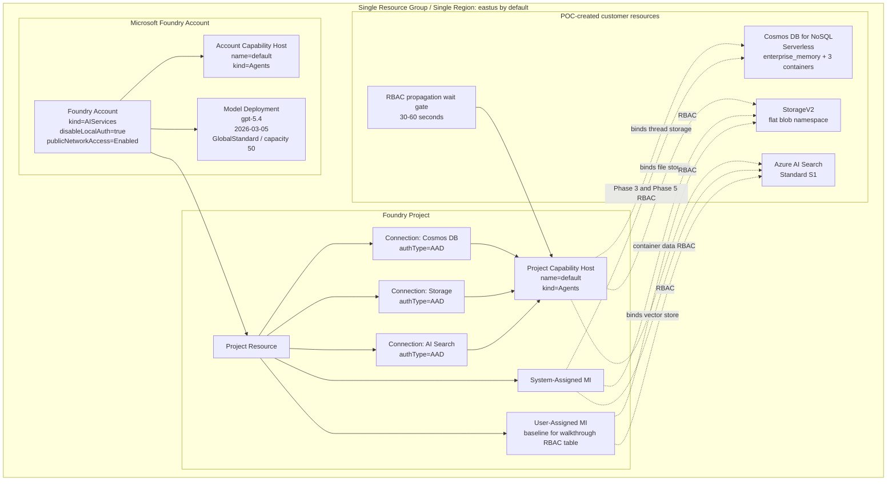

# 實作計畫：Foundry Standard Agent Greenfield POC

**分支**：`001-foundry-poc` | **日期**：2026-05-13 | **規格**：[spec.md](./spec.md)
**輸入**：來自 [specs/001-foundry-poc/spec.md](./spec.md) 的功能規格

## 摘要

建立一套 Bicep-based Greenfield POC，用單一 resource group、單一 region、單一 Foundry project 部署 Microsoft Foundry Standard Agent Setup。部署會從零建立 Foundry account/project、`gpt-5.4` model deployment、Cosmos DB Serverless、Storage、AI Search、AAD-only project connections、account/project capability hosts、Project SMI + UMI，以及 walkthrough Phase 3 + Phase 5 要求的最小權限 RBAC。Implementation 階段只能產生 IaC 與 Bash 腳本；除非使用者明確說 `deploy now`，不得執行 `az deployment group create`。

## 技術情境

**語言/版本**：Bicep for Azure IaC；Bash for deployment and verification scripts
**主要相依套件**：Azure CLI、Azure Bicep CLI、curl、jq
**儲存方式**：Azure Cosmos DB for NoSQL Serverless for agent thread storage；Azure Storage for file state；Azure AI Search for vector store
**測試工具**：`az bicep build`、`az deployment group what-if`、`az rest`、`az cosmosdb`、management REST、curl smoke tests
**目標平台**：Linux Bash environment with authenticated Azure CLI
**專案類型**：Infrastructure-only POC with documentation and scripts
**效能目標**：Greenfield deployment plus basic verification within 30 minutes when quota is available
**約束條件**：No hardcoded secrets, connection strings, subscription IDs, API keys, service principals, PowerShell, private endpoints, CMK, APIM, or capability host updates
**規模/範圍**：One resource group, one region, one Foundry account, one project, one model deployment, one Cosmos DB account, one Storage account, one AI Search service

## 憲章檢查

_關卡：必須在階段 0 研究前通過。階段 1 設計後重新檢查。_

`.specify/memory/constitution.md` 已補齊此 POC 的可執行治理基準：walkthrough/source-of-truth 優先、Spec → Plan → Tasks → Implementation 階段 gate、secure Azure IaC、guarded deployment、verification-first delivery。此計畫遵守上述 gates；Phase 2 不產生 implementation files，Phase 4 不得在使用者明確說 `deploy now` 前執行 `az deployment group create`。

**階段 1 後重新檢查**：research、data-model、contracts、quickstart 均維持設計文件層級，未新增 implementation code；角色與驗證缺口已在 Phase 3 前收斂，無憲章違規。

## 架構圖



此圖對齊 walkthrough §3，但套用 Phase 1/clarify 決策：public network access enabled、Cosmos DB Serverless、Project SMI + UMI、baseline wait gate、model 改為 `gpt-5.4`，並保留 account-level capability host 與 project-level capability host。

## Bicep Module 檔案結構

Implementation 階段預計建立以下結構，對照官方 sample `43-standard-agent-setup-with-customization`，但移除 existing resource ID 模式，改為 Greenfield-only：

```text
infra/
├── main.bicep
├── main.bicepparam
├── modules/
│   ├── dependent-resources.bicep
│   ├── foundry-account.bicep
│   ├── foundry-project.bicep
│   ├── project-connections.bicep
│   ├── account-role-assignments.bicep
│   ├── cosmosdb-role-assignments.bicep
│   ├── storage-role-assignments.bicep
│   ├── search-role-assignments.bicep
│   ├── rbac-propagation-wait.bicep
│   └── project-capability-host.bicep
└── scripts/
   ├── deploy.sh
   ├── verify.sh
   └── smoke-test-reasoning.sh
```

| Planned file                      | 對照官方 sample                                                                                | 職責                                                                                                                                                                                                                                                                |
| --------------------------------- | ---------------------------------------------------------------------------------------------- | ------------------------------------------------------------------------------------------------------------------------------------------------------------------------------------------------------------------------------------------------------------------- |
| `main.bicep`                      | `main.bicep`                                                                                   | Declares all parameters, derives names from `namePrefix='ms'`, orchestrates modules, exports outputs for scripts.                                                                                                                                                   |
| `main.bicepparam`                 | `main.bicepparam`                                                                              | POC defaults: `eastus`, `gpt-5.4`, `2026-03-05`, `GlobalStandard`, capacity 50.                                                                                                                                                                                     |
| `dependent-resources.bicep`       | `standard-dependent-resources.bicep`                                                           | Creates Cosmos DB Serverless, StorageV2, AI Search Standard S1, and UMI; no existing resource ID parameters.                                                                                                                                                        |
| `foundry-account.bicep`           | `ai-account-identity.bicep`                                                                    | Creates Foundry account, account SMI, model deployment, and required account-level capability host.                                                                                                                                                                 |
| `foundry-project.bicep`           | `ai-project-identity.bicep`                                                                    | Creates project with SystemAssigned + UserAssigned identity to satisfy security baseline and walkthrough RBAC table.                                                                                                                                                |
| `project-connections.bicep`       | `add-project-connections.bicep`                                                                | Creates Cosmos DB, Storage, and AI Search project connections with `authType: 'AAD'`.                                                                                                                                                                               |
| `account-role-assignments.bicep`  | `standard-ai-account-role-assignments.bicep`                                                   | Compatibility insertion point only. Baseline assigns no additional Foundry account/project management-plane roles beyond the service-specific modules below; if implementation/provider validation reveals a named role is required, stop and ask before adding it. |
| `cosmosdb-role-assignments.bicep` | `cosmosdb-account-role-assignment.bicep`                                                       | Implements Phase 3 Cosmos DB Operator at account scope and Phase 5 Cosmos DB Built-in Data Contributor at account scope per §5.6.                                                                                                                                   |
| `storage-role-assignments.bicep`  | `azure-storage-account-role-assignment.bicep`, `blob-storage-container-role-assignments.bicep` | Assigns Storage Account Contributor at account scope and blob data roles at Foundry-generated container scopes.                                                                                                                                                     |
| `search-role-assignments.bicep`   | `ai-search-role-assignments.bicep`                                                             | Assigns Search Index Data Contributor and Search Service Contributor to Project SMI + UMI.                                                                                                                                                                          |
| `rbac-propagation-wait.bicep`     | Walkthrough §8 notes optional deploymentScripts sleep                                          | Adds a minimal 30-60 second wait gate after RBAC role assignments and before project capability host creation.                                                                                                                                                      |
| `project-capability-host.bicep`   | `add-project-capability-host.bicep`                                                            | Creates immutable project capability host after connections, RBAC, and wait gate are complete.                                                                                                                                                                      |

## Resource 部署順序與 dependsOn 鏈

### Step 1: Name derivation in `main.bicep`

- Use `namePrefix = 'ms'` by default.
- Add a deterministic suffix with `uniqueString(resourceGroup().id, location, namePrefix)`.
- Names: Foundry account `msai${token}`, project `msproj${token}`, Cosmos DB `ms-cosmos-${token}`, Storage `msst${token}`, Search `ms-srch-${token}`, UMI `ms-agent-mi-${token}`.
- Keep each generated name within Azure service limits, especially Storage account 3-24 lowercase alphanumeric and Cosmos DB 3-50 lowercase/dash.

### Step 2: Dependent resources first

- Create UMI, Cosmos DB Serverless, StorageV2, and AI Search Standard S1.
- Cosmos DB must use Serverless capability; no provisioned RU/s parameters for POC.
- Storage hierarchical namespace must remain disabled for flat blob behavior.

### Step 3: Foundry account and model deployment

- Create `Microsoft.CognitiveServices/accounts` with `kind: 'AIServices'`, `allowProjectManagement: true`, `publicNetworkAccess: 'Enabled'`, and `disableLocalAuth: true`.
- Create account-level capability host `default` even if it only declares `capabilityHostKind: 'Agents'`.
- Create model deployment with `gpt-5.4`, `2026-03-05`, `GlobalStandard`, capacity 50.

### Step 4: Foundry project identity

- Create project under the Foundry account.
- Baseline identity: `SystemAssigned, UserAssigned`.
- Rationale: SMI satisfies the security baseline; UMI aligns with walkthrough §3 and §5.7/§5.8 where Storage and Search roles are assigned to Project SMI + UMI. No service principal or secret is introduced.

### Step 5: Project connections

- Create Cosmos DB, Storage, and AI Search project connections.
- Each connection must set `authType: 'AAD'` and include target resource metadata.
- `project-connections.bicep` depends on project and dependent resources.

### Step 6: RBAC before project capability host

- Account/project role module baseline: keep `account-role-assignments.bicep` as a no-op compatibility module that accepts account/project IDs and Project SMI/UMI principal IDs, emits deterministic empty outputs, and creates no role assignments unless a user-approved walkthrough/provider requirement names an exact role, scope, and principal.
- Cosmos DB Phase 3: assign `Cosmos DB Operator` at Cosmos DB account scope to Project SMI.
- Cosmos DB Phase 5: assign Cosmos DB Built-in Data Contributor SQL role at account scope to Project SMI, following §5.6 because `enterprise_memory` is created during capability host provisioning.
- Storage: assign `Storage Account Contributor` at account scope to Project SMI, then blob data roles at the Foundry-generated container scopes to Project SMI + UMI following §5.7.
- AI Search: assign `Search Index Data Contributor` and `Search Service Contributor` to Project SMI + UMI following §5.8.

### Step 7: Capability host RBAC propagation handling

- `rbac-propagation-wait.bicep` must `dependsOn` all RBAC modules and provide a minimal 30-60 second wait before project capability host creation.
- `project-capability-host.bicep` must `dependsOn` all connection resources, all RBAC modules, and the wait gate.
- Cosmos DB data role remains account-scoped per walkthrough §5.6; do not pre-bind to `enterprise_memory` or individual containers because they do not exist yet.
- If deployment still fails due to Azure RBAC eventual consistency, the supported recovery path is rerun the same deployment. This is not a capability host update and must not mutate an already succeeded capability host.

### Step 8: Verification and smoke tests after deployment

- `verify.sh` checks account/project capability host provisioning state, project capability host thread/file/vector connection bindings, AAD project connections, Project SMI + UMI, model deployment state, Cosmos DB `enterprise_memory` and three containers, RBAC scopes, and one Chat Completions `Hello` call.
- `smoke-test-reasoning.sh` sends a separate `reasoning_effort: "low"` request.
- Neither script may include `temperature`, `top_p`, `presence_penalty`, `frequency_penalty`, `logprobs`, or `logit_bias`.

## API Version Plan

Walkthrough is the source of truth for Foundry Standard Agent Setup behavior. Bicep schema lookup shows newer versions exist for some resource providers, but this plan pins walkthrough-listed Foundry versions and uses latest schema lookup only where walkthrough does not specify.

| Resource type                                                   | Planned API version                           | Source / rationale                                                                                   |
| --------------------------------------------------------------- | --------------------------------------------- | ---------------------------------------------------------------------------------------------------- |
| `Microsoft.CognitiveServices/accounts`                          | `2025-04-01-preview`                          | Walkthrough §5.3; user-approved pin.                                                                 |
| `Microsoft.CognitiveServices/accounts/deployments`              | `2025-04-01-preview`                          | Same Foundry account API family; user-approved pin.                                                  |
| `Microsoft.CognitiveServices/accounts/capabilityHosts`          | `2025-04-01-preview`                          | Walkthrough §5.3; user-approved pin.                                                                 |
| `Microsoft.CognitiveServices/accounts/projects`                 | `2025-04-01-preview`                          | Same Foundry project API family; user-approved pin.                                                  |
| `Microsoft.CognitiveServices/accounts/projects/connections`     | `2025-04-01-preview`                          | Walkthrough §5.4; user-approved pin.                                                                 |
| `Microsoft.CognitiveServices/accounts/projects/capabilityHosts` | `2025-04-01-preview`                          | Walkthrough §5.5; user-approved pin.                                                                 |
| `Microsoft.DocumentDB/databaseAccounts`                         | `2024-05-15`                                  | Walkthrough §5.2 and §5.6; implementation must ensure Serverless capability works with this version. |
| `Microsoft.DocumentDB/databaseAccounts/sqlRoleAssignments`      | `2024-05-15`                                  | Walkthrough §5.6.                                                                                    |
| `Microsoft.Authorization/roleAssignments`                       | `2022-04-01`                                  | Walkthrough §5.6 and schema lookup.                                                                  |
| `Microsoft.Storage/storageAccounts`                             | `2025-01-01`                                  | Latest schema lookup; walkthrough does not name a storage API version.                               |
| `Microsoft.Storage/storageAccounts/blobServices/containers`     | `2025-01-01`                                  | Same Storage API family if explicit container scope declarations are needed.                         |
| `Microsoft.Search/searchServices`                               | `2025-05-01`                                  | Latest schema lookup; walkthrough does not name a Search API version.                                |
| `Microsoft.ManagedIdentity/userAssignedIdentities`              | `2024-11-30`                                  | Latest schema lookup for baseline UMI.                                                               |
| `Microsoft.Resources/deploymentScripts`                         | Latest stable available during implementation | Baseline wait gate after RBAC and before project capability host; use Bash only.                     |

**Implementation gate**：Foundry API family is pinned to walkthrough baseline `2025-04-01-preview`. If `az bicep build` or provider validation rejects it and requires `2025-06-01`, stop and ask before changing the Foundry API family.

## East US Model Quota 風險與 Fallback 邏輯

### Primary target

- Region: `eastus`
- Model: `gpt-5.4`
- Version: `2026-03-05`
- SKU: `GlobalStandard`
- Capacity: 50

### Risk assessment

- East US is a high-demand region; `GlobalStandard` capacity for new reasoning models may be unavailable or quota-limited.
- The expected failure class is `InsufficientQuota`, capacity unavailable, or model deployment validation failure during account deployment.
- `what-if` may not fully prove model capacity availability; final deployment can still fail during provider provisioning.

### Fallback selection logic

1. Keep `gpt-5.4` as the default and preferred POC target.
2. If deployment fails specifically because of model quota/capacity, first fallback option is `gpt-5.4-mini` version `2026-03-17`.
   - Tradeoff: closest model family and likely better capacity profile, but not equivalent to `gpt-5.4`; README must label it separately.
3. If `gpt-5.4-mini` is also unavailable, second fallback option is `gpt-5-mini` version `2025-08-07`.
   - Tradeoff: older/different model line; use only to validate Standard Agent Setup plumbing, not `gpt-5.4` behavior.
4. Fallback is an explicit parameter change by the user; scripts and README may guide it, but templates must not silently switch model names.
5. Smoke test requirements remain unchanged for reasoning models: do not send unsupported sampling parameters.

## 開放議題與決策

1. **RBAC propagation wait gate**
   - 決策：baseline 納入最小 wait gate（約 30-60 秒），位於 RBAC role assignments 之後、project capability host 建立之前。
   - 影響：稍微增加部署時間，但降低首次部署因 RBAC eventual consistency 失敗的機率；不會 update immutable capability host。

2. **Foundry API version pinning**
   - 決策：Phase 4 固定使用 walkthrough 明列的 `2025-04-01-preview`；若 build/provider validation 要求更新，必須停下確認是否升到 `2025-06-01`。
   - 影響：保守貼近 walkthrough，但可能需要一次 implementation-time 調整。

3. **Naming shape for `ms` prefix**
   - 決策：使用 `namePrefix='ms'` 加 deterministic suffix，例：Foundry account `msai${token}`、project `msproj${token}`、Cosmos DB `ms-cosmos-${token}`、Storage `msst${token}`、Search `ms-srch-${token}`、UMI `ms-agent-mi-${token}`。
   - 影響：符合 `ms` prefix 與 Azure 命名限制；Storage 需全小寫無 dash。

4. **UMI inclusion**
   - 決策：建立 UMI 並將 Project identity 設為 `SystemAssigned, UserAssigned`。
   - 影響：多一個 managed identity resource，但最貼近 walkthrough 的 SMI + UMI RBAC 表，且不違反安全基線。

5. **Resource group creation**
   - 決策：維持 Phase 1 假設，resource group 由使用者預先建立；`deploy.sh` 檢查 RG 存在但不自動建立。
   - 影響：避免 deployment scope 從 resource group 變成 subscription scope，維持 `az deployment group create` 一鍵部署要求。

## 專案結構

### 文件（此功能）

```text
specs/001-foundry-poc/
├── plan.md
├── research.md
├── data-model.md
├── quickstart.md
├── contracts/
│   └── script-contracts.md
└── tasks.md              # Phase 3 才建立
```

### 原始碼（儲存庫根目錄）

```text
infra/
├── main.bicep
├── main.bicepparam
├── modules/
└── scripts/

README.md
```

**結構決策**：此功能是 infrastructure-only POC，不新增 application source tree。Phase 4 只會在 `infra/` 與 root README 產生實作檔案。

## 複雜度追蹤

無憲章違規。UMI、wait gate、分模組 Bicep 結構皆源於 walkthrough 或已核准的 POC 可靠性需求。
